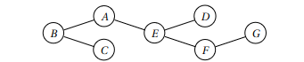

## Questão 7º)

## Enunciado:

Uma cobertura de vértices de um grafo G = (V, E ) é
um subconjunto de vértices S ⊆ V que inclui ao me-
nos uma extremidade de cada aresta de E . Forneça
um algoritmo de tempo linear para a seguinte tarefa.
Entrada: Uma árvore não-direcionada T = (V, E ) .
Saída: O tamanho da menor cobertura de vértices de
T .
Por exemplo, na árvore abaixo, as possíveis co-
berturas de vértice incluem {A, B,C , D, E , F,G} e
{A,C , D, F }, mas não {C , E , F }. A menor cobertura de
vértice tem tamanho 3: {B, E ,G}.



## Resposta:

```
def min_vertex_cover_size(T):
    n = len(T)
    E = [[] for _ in range(n+1)]
    for u, v in T:
        E[u].append(v)
        E[v].append(u)
    root = n+1
    E[root] = [v for v in range(1, n+1)]
    size0 = [0] * (n+2)
    size1 = [0] * (n+2)
    visited = [False] * (n+2)

    def dfs(v):
        visited[v] = True
        size0[v] = 0
        size1[v] = 1
        for w in E[v]:
            if not visited[w]:
                dfs(w)
                size0[v] += min(size1[w], size0[w])
                size1[v] += size0[w]

    dfs(root)
    return min(size0[root], size1[root])

```
